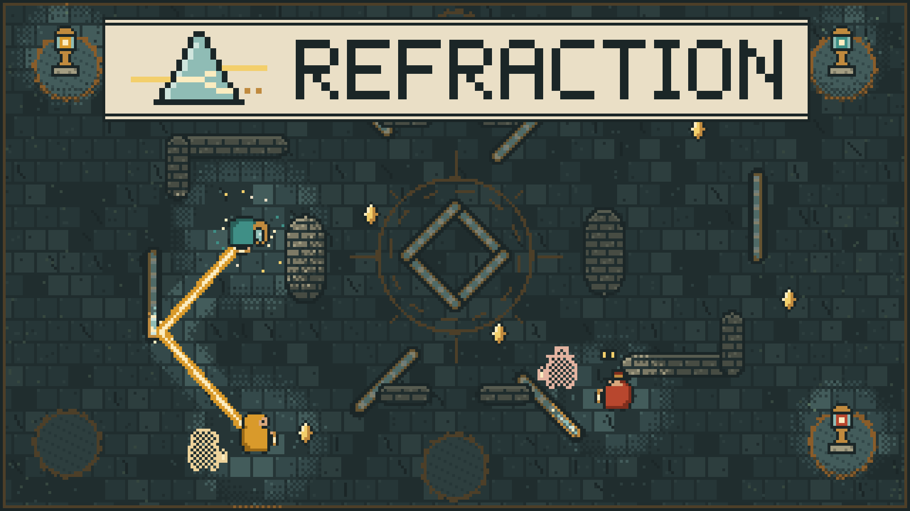

# Refraction: The Lens Works

A lantern duel for 2 to 6 players in the browser. Throw beams of lamplight off brass mirrors, carry amber lenses back to your beacon, and keep clear of other keepers' echoes.

Play: https://refraction-room.vercel.app



## How a round works

- The prism at the centre casts a lens into the hall every few seconds. Walk over one to carry it (up to five; each one slows you down) and stand on your own beacon to bank it.
- The first keeper to bank the target lights their lighthouse and wins. If the clock runs out first, most lenses wins. The host picks the target (5 to 20, default 10) and the round length (2 to 8 minutes, default 3) in the lobby.
- A beam bounces off brass and stops on stone. A keeper it catches is knocked flat, drops everything they carry, and loses one banked lens straight into the catcher's hands.
- Your echo walks your path three seconds behind you and throws every beam again from where you stood. Any other keeper who walks into your echo is caught, just as if a beam hit them. An echo is harmless while it retraces a moment its keeper spent knocked down.

Controls: WASD or arrows to walk, mouse to aim, click or Space to throw. On a phone, drag on the left half to walk and on the right half to aim; let go to throw.

Practice mode teaches the game in about a minute against two bots, with no account and no network.

## Rooms

Create a room, then send the link, the five-letter code, or the QR code from the lobby. Everyone picks a figure and a lantern colour. Colours are unique per room; beacons are assigned fairly when each round starts.

If the host closes their tab, loses connection, or switches away mid-round, the longest-present keeper takes over and the round carries on.

## Run locally

```bash
npm install
npm run dev
```

Practice and the front-page demo run without any backend. Online rooms need Firebase:

1. Create a Firebase project, enable Anonymous sign-in, and create a Realtime Database.
2. Copy `.env.example` to `.env.local` and fill every `VITE_FIREBASE_*` value from the web app config.
3. Deploy the rules: `firebase deploy --only database`.

Other commands:

- `npm test` runs the simulation tests (map, bolts, pickups, banking, steals, casting, echoes).
- `npx tsx scripts/bot.ts ROOMCODE [name]` joins a room as a headless test guest.
- `npx tsx scripts/cover.ts` re-renders the cover image from the game's own art.
- `npx tsx scripts/favicon.ts` re-renders the favicon from the brandmark.

## How it is built

React 19, TypeScript, Vite and Phaser 3, with Firebase Realtime Database for rooms. Every pixel comes from hand-made sprite grids in `src/art`, rendered to canvas for the arena and to SVG for the site.

Each player simulates their own keeper and publishes its position 20 times a second; other keepers are drawn slightly in the past and interpolated, so movement stays smooth on a guest's screen. Every client traces the same bolt paths from each shot, and the player who gets hit reports it. One player, the host, owns the shared state (lenses, scores, the winner) and writes it only when it changes.

## Deploy

The project deploys on Vercel from the `main` branch. Set every `VITE_FIREBASE_*` variable for Production and Preview.

## Contest submission

**Title:** Refraction

**Description:** A lantern duel for 2 to 6 players, on phones and computers. Bounce beams of lamplight off brass mirrors to catch rivals and steal the lenses they have banked, while you race amber lenses from the central prism back to your own beacon. Every move you make leaves an echo that walks your path three seconds later, repeats your beams, and catches anyone who touches it. First to bank ten lights the lighthouse. Create a room, share the link or QR code, and play; no sign-up.

**Cover:** `public/assets/refraction-cover.png` (1920 x 1080)

**URL:** https://refraction-room.vercel.app
